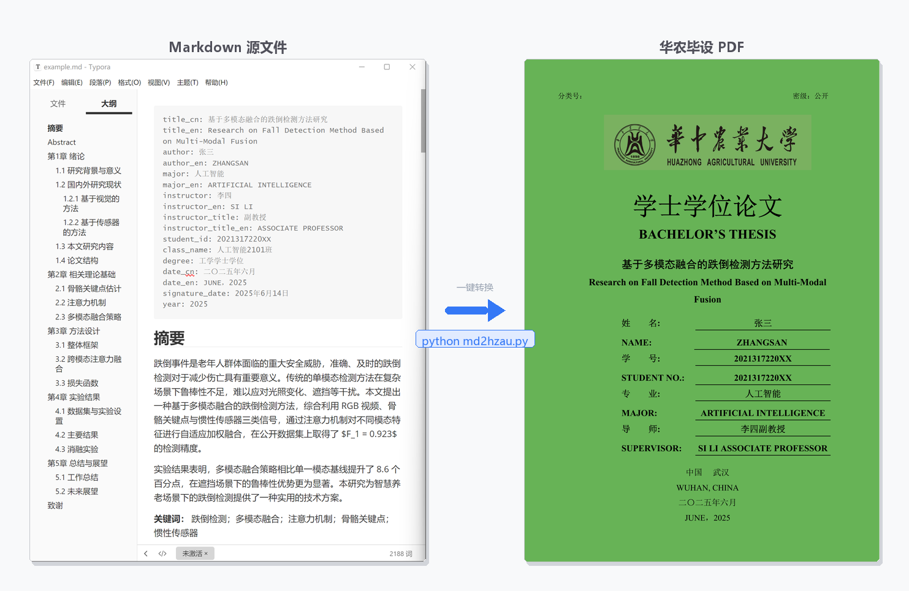

# md2hzau

将 Markdown 论文一键转换为[华中农业大学本科毕业论文 LaTeX 模板](https://github.com/eriche2016/HZAU_UnderGraduateThesis_Template)格式。

Convert a Markdown thesis to the [HZAU undergraduate thesis LaTeX template](https://github.com/eriche2016/HZAU_UnderGraduateThesis_Template) with a single command — no manual editing required.



---

## 推荐工作流 Recommended Workflow

```
git clone https://github.com/01Elaine/md2hzau   ← 先 clone 本项目
          ↓
   参考 example.md 了解 MD 格式规范
          ↓
   AI 工具起草初稿（推荐 Claude Code 或 Codex）
   提示词示例："根据以下实验记录，参考 example.md 的格式，
               写第3章方法部分，输出符合 md2hzau 规范的 Markdown"
          ↓
   Typora 修改润色（人机通读的中间格式）
   — 补充导师意见、调整逻辑、插入图表引用
          ↓
   python md2hzau.py 论文.md   ← 本项目
          ↓
   latexmk 编译 → 论文.pdf
          ↓（可选）
   上传 template/ 目录到 Overleaf，在线微调格式细节
```

**为什么选 Markdown 作为中间格式？**
- AI 输出 Markdown 比直接输出 LaTeX 更稳定、错误更少
- Typora 渲染效果接近最终排版，适合人工审阅和修改
- `.md` 文件易于版本管理，diff 可读，方便与导师协作

**Overleaf 上传方式：** 将 `template/` 目录下的所有文件打包上传，在菜单中选择 XeLaTeX 编译器即可。如编译超时，可先注释掉 `\printbibliography`，编译一次后再取消注释重新编译。

---

## 快速开始 Quick Start

### 第一步：准备 MD 文件

在 Markdown 文件最顶部写个人信息（YAML frontmatter），然后按固定结构写正文：

```markdown
---
title_cn: 基于多模态融合的跌倒检测方法研究
title_en: Research on Fall Detection Method Based on Multi-Modal Fusion
author: 张三
author_en: ZHANGSAN
major: 人工智能
major_en: ARTIFICIAL INTELLIGENCE
instructor: 李四
instructor_en: SI LI
instructor_title: 副教授
instructor_title_en: ASSOCIATE PROFESSOR
student_id: 2022317220XX
class_name: 人工智能2201班
degree: 工学学士学位
date_cn: 二〇二五年六月
date_en: JUNE，2025
signature_date: 2025年6月14日
year: 2025
---

## 摘要

摘要正文...

**关键词：** 关键词1；关键词2；关键词3

## Abstract

Abstract text...

**Keywords:** keyword1; keyword2; keyword3

## 第1章 绪论

### 1.1 研究背景

正文内容，引用写 [1]、[2,3]...

## 第2章 相关工作

...

## 致谢

致谢内容...
```

完整示例见 [`example.md`](example.md)。

### 第二步：克隆本仓库（已内含模板）

```bash
git clone https://github.com/01Elaine/md2hzau
cd md2hzau
```

仓库结构：

```
md2hzau/
├── md2hzau.py          ← 转换脚本
├── example.md          ← 完整示例论文
├── template/           ← HZAU 模板（已内置）
│   ├── main.tex        ← 模板主文件（工具自动 patch）
│   ├── HZAU.cls        ← 文档类
│   ├── references.bib  ← 参考文献（你来填写）
│   └── Fig/            ← 图片放这里
└── figures/            ← 示例图片
```

### 第三步：运行转换

```bash
python md2hzau.py 你的论文.md
```

工具自动生成两个文件：
- `template/你的论文_main.tex` — patch 好个人信息、摘要、致谢的主文件
- `template/chapters/content.tex` — 所有正文章节

### 第四步：填写参考文献

编辑 `template/references.bib`，添加你的参考文献条目（BibTeX 格式）：

```bibtex
@article{ref1,
  author = {作者},
  title  = {论文题目},
  journal = {期刊名},
  year   = {2024}
}
```

正文中的 `[1]`、`[2,3]` 会自动转为 `\cite{ref1}`、`\cite{ref2,ref3}`。

### 第五步：把图片放入 `template/Fig/`

正文中的图片引用：
```markdown

**图1-1** 图片标题
```
工具只取文件名，编译时从 `template/Fig/` 读取图片。

### 第六步：编译 PDF

```bash
cd template
latexmk -xelatex 你的论文_main.tex
```

或者用 xelatex 手动编译（需运行两次修正交叉引用）：

```bash
cd template
xelatex -interaction=nonstopmode 你的论文_main.tex
biber 你的论文_main
xelatex -interaction=nonstopmode 你的论文_main.tex
```

---

## 依赖 Requirements

- Python 3.8+（标准库，**无需安装额外 Python 包**）
- XeLaTeX（MiKTeX 或 TeX Live）
- Biber（随 MiKTeX/TeX Live 附带，用于处理参考文献）

---

## Markdown 格式规范

### frontmatter 字段

| 字段 | 说明 | 示例 |
|------|------|------|
| `title_cn` | 中文题目 | `基于多模态融合的跌倒检测方法研究` |
| `title_en` | 英文题目 | `Research on Fall Detection...` |
| `author` | 学生姓名（中文） | `张三` |
| `author_en` | 学生姓名（英文大写） | `ZHANGSAN` |
| `major` | 专业（中文） | `人工智能` |
| `major_en` | 专业（英文大写） | `ARTIFICIAL INTELLIGENCE` |
| `instructor` | 导师姓名（中文） | `李四` |
| `instructor_en` | 导师姓名（英文） | `SI LI` |
| `instructor_title` | 导师职称（中文） | `副教授` |
| `instructor_title_en` | 导师职称（英文） | `ASSOCIATE PROFESSOR` |
| `student_id` | 学号 | `2022317220XX` |
| `class_name` | 专业班级 | `人工智能2201班` |
| `degree` | 学位名称 | `工学学士学位` |
| `date_cn` | 中文日期（封面） | `二〇二五年六月` |
| `date_en` | 英文日期（封面） | `JUNE，2025` |
| `signature_date` | 签名日期 | `2025年6月14日` |
| `year` | 毕业年份（页眉） | `2025` |

### 章节结构

```markdown
## 第1章 绪论          ← 一级章（LaTeX \section）
### 1.1 研究背景       ← 二级节（LaTeX \subsection）
#### 1.1.1 具体内容   ← 三级节（LaTeX \subsubsection）
```

章节标题里的编号前缀（`第1章`、`1.1`）会被自动去掉，不会和 LaTeX 自动编号重复。

### 图片

```markdown

**图1-1** 图片标题说明
```

图片文件需放在 `template/Fig/` 目录下。

### 表格

```markdown
**表2-1** 实验结果对比

| 方法 | 精确率 | 召回率 |
|------|--------|--------|
| 基线 | 0.85   | 0.82   |
```

### 数学公式

行内：`$E = mc^2$`

独立：
```markdown
$$
\mathbf{H}^{(l+1)} = \sigma\left(\hat{A}\mathbf{H}^{(l)}\mathbf{W}^{(l)}\right)
$$
```

### 参考文献引用

正文中写 `[1]`、`[2,3]`，自动转换为 `\cite{ref1}`、`\cite{ref2,ref3}`。

参考文献条目在 `template/references.bib` 中维护，key 命名为 `ref1`、`ref2` 等与正文编号对应。

---

## 命令行参数

| 参数 | 说明 | 默认值 |
|------|------|--------|
| `md` | Markdown 源文件（位置参数） | — |
| `--template` | main.tex 路径 | `template/main.tex` |
| `--output` | 输出主 .tex 路径 | `<template目录>/<stem>_main.tex` |
| `--img-prefix` | 图片路径前缀（相对于 template 目录） | `Fig/` |

---

## 已知限制

- 图片宽度固定为 `0.88\textwidth`（单图），子图宽度按数量自动分配
- 不支持多层嵌套列表（只支持单层 `- item` 和 `（1）item`）
- 签名图片（`Fig/author_signature.png`、`Fig/mentor_signature.png`）需自行提供
- **不支持跨页长表格（longtable）**：如需续表，请在生成的 `.tex` 文件中手动将对应 `table` 环境改为 `longtable`，参考 `template/chapters/chapter4.tex` 中的注释示例

---

## 协议 License

**md2hzau 脚本**（`md2hzau.py`）：MIT © md2hzau contributors

**内置 LaTeX 模板**（`template/` 目录）：LPPL-1.3c © [Xinwei He (eriche2016)](https://github.com/eriche2016/HZAU_UnderGraduateThesis_Template)，原始文件未经修改，按 LPPL 条款随本仓库分发。
