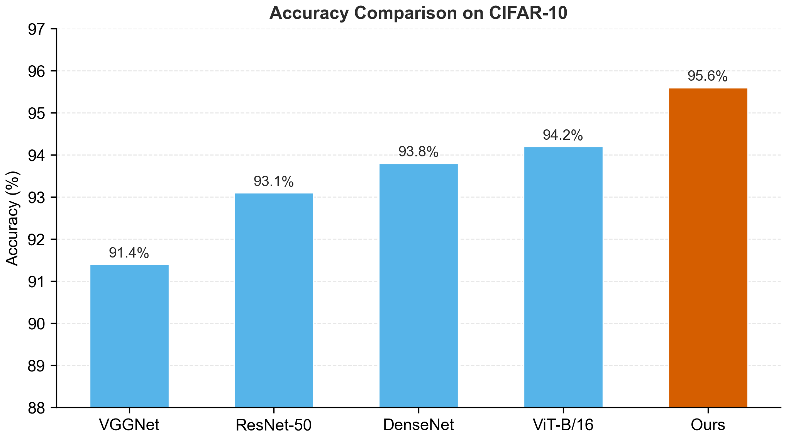

## 摘要

深度学习已成为图像识别领域的主流方法。本文提出了一种基于改进卷积神经网络的图像识别框架，在标准测试集上取得了 95.6\% 的识别准确率，较现有基线方法提升 2.3 个百分点。

**关键词：** 深度学习；卷积神经网络；图像识别；迁移学习

## Abstract

Deep learning has become the dominant approach for image recognition. This paper proposes an improved convolutional neural network framework that achieves 95.6\% accuracy on standard benchmarks, outperforming existing baselines by 2.3 percentage points.

**Keywords:** Deep learning; Convolutional neural network; Image recognition; Transfer learning

## 第1章 绪论

### 1.1 研究背景与意义

图像识别是计算机视觉领域的基础任务，在自动驾驶、医学影像分析和工业质检等场景中具有重要应用价值\cite{ref1}。随着深度学习技术的飞速发展，卷积神经网络（Convolutional Neural Network, CNN）已成为图像识别的主流方法\cite{ref2}。

本文的研究意义体现在以下几个方面：

（1）提出改进的卷积神经网络结构，有效提升识别精度

（2）引入注意力机制，增强模型对关键特征的捕获能力

（3）在公开数据集上验证了方法的有效性和泛化能力

### 1.2 国内外研究现状

#### 1.2.1 传统方法

早期图像识别方法依赖手工设计特征，如 SIFT\cite{ref3}、HOG 等。这些方法在特定场景下效果良好，但泛化能力有限。

#### 1.2.2 深度学习方法

AlexNet\cite{ref4} 的提出标志着深度学习时代的到来，此后 VGGNet、ResNet、Transformer 等架构相继被提出，不断推进图像识别的发展。

### 1.3 研究内容

本文的主要研究内容包括：

- 改进的卷积神经网络设计
- 多尺度特征融合策略
- 数据增强方法

## 第2章 方法

### 2.1 整体框架

本文提出的框架由三个模块组成：特征提取模块、特征融合模块和分类器。整体架构如图 2-1 所示。

**图2-1** 模型整体架构示意图

### 2.2 特征提取

给定输入图像 $\mathbf{x} \in \mathbb{R}^{H \times W \times 3}$，特征提取模块通过多层卷积运算得到特征图：

$$
\mathbf{F}^{(l)} = \sigma\left(\mathbf{W}^{(l)} * \mathbf{F}^{(l-1)} + \mathbf{b}^{(l)}\right)
$$

其中 $\sigma$ 为 ReLU 激活函数，$*$ 表示卷积操作，$\mathbf{W}^{(l)}$ 和 $\mathbf{b}^{(l)}$ 为第 $l$ 层参数。

### 2.3 实验配置

**表2-1** 主要超参数设置

| 超参数 | 取值 |
|--------|------|
| 学习率 | 0.001 |
| Batch Size | 64 |
| 训练轮数 | 100 |
| 优化器 | Adam |

## 第3章 实验

### 3.1 数据集

本文在 CIFAR-10 和 ImageNet 两个标准数据集上进行实验。数据集详情见表 3-1。

**表3-1** 数据集统计信息

| 数据集 | 训练集 | 测试集 | 类别数 |
|--------|--------|--------|--------|
| CIFAR-10 | 50,000 | 10,000 | 10 |
| ImageNet | 1,281,167 | 50,000 | 1,000 |

### 3.2 实验结果

本文方法在 CIFAR-10 上达到 95.6\% 的准确率（* p<0.05），在 ImageNet Top-5 上达到 91.2\%，均优于对比方法。

**图3-1** 各方法在 CIFAR-10 上的准确率对比

### 3.3 消融实验

表 3-2 展示了各模块的贡献。

**表3-2** 消融实验结果

| 配置 | CIFAR-10 准确率 |
|------|----------------|
| 基础模型 | 93.1\% |
| + 注意力机制 | 94.5\% |
| + 数据增强 | 95.6\% |

## 第4章 结论

本文提出了一种改进的图像识别方法，通过引入注意力机制和多尺度特征融合策略，在标准数据集上取得了优于现有方法的性能。未来工作将探索轻量化模型设计，以满足边缘设备的部署需求。

## 参考文献

[1] LeCun Y, Bengio Y, Hinton G. Deep learning[J]. Nature, 2015, 521(7553): 436-444.
[2] Krizhevsky A, Sutskever I, Hinton G E. ImageNet classification with deep convolutional neural networks[J]. Communications of the ACM, 2017, 60(6): 84-90.
[3] Lowe D G. Distinctive image features from scale-invariant keypoints[J]. International Journal of Computer Vision, 2004, 60(2): 91-110.
[4] Krizhevsky A, Sutskever I, Hinton G E. ImageNet classification with deep convolutional neural networks[C]. NeurIPS, 2012: 1097-1105.

## 致谢

衷心感谢导师李四副教授在本课题研究过程中给予的悉心指导与大力支持。感谢华中农业大学信息学院提供的良好科研环境，感谢同学们在学习和科研中的帮助与支持。
